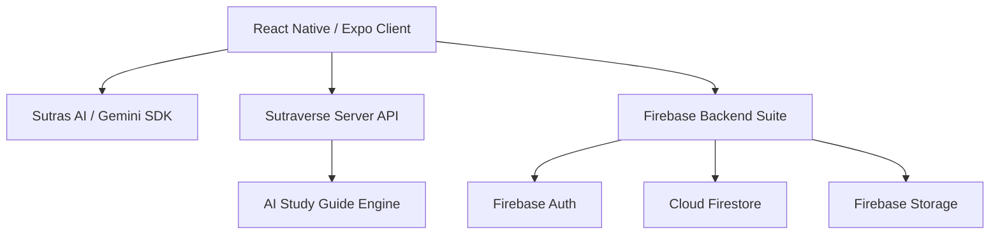

# 📚 Sutras Mobile — Technical Pitch Sheet
> **"The Student OS"** — A high-performance, AI-native academic workspace and community platform for college students.

---

## 🚀 High-Level Architecture Overview

Sutras Mobile is a universal native application designed for high performance, rich animations, and offline-first capabilities.



---

## 🛠️ The Core Tech Stack

| Technology / Library | Layer | Purpose |
| :--- | :--- | :--- |
| **React Native (v0.81.5)** | Core Framework | Native rendering on iOS & Android using a single TypeScript codebase. |
| **Expo SDK 54** | App Framework | Provides native device access, configuration management, and the compilation build chain (**EAS**). |
| **TypeScript** | Language | Ensuring compile-time type safety across routes, states, and API contracts. |
| **Expo Router v6** | Navigation | Type-safe, file-based routing mimicking Next.js app directory layouts (`src/app/_layout.tsx`). |
| **Firebase Suite** | Backend | Scalable serverless layer for database, storage, and authentication. |
| **Google Gemini API** | Artificial Intelligence | Native client-side SDK running **Gemini 2.5 Flash** for real-time academic copilot capabilities. |

---

## 🧠 AI-Native Features (The "Wow" Factor)

### 1. Sutras AI Academic Partner (`src/app/(tabs)/assistant.tsx`)
* **Under the Hood:** Integrated using the native `@google/generative-ai` SDK.
* **Model:** `gemini-2.5-flash` chosen for its sub-second response times and high contextual awareness.
* **Tailored System Instructions:** Configured to act as a structured, encouraging university professor. It formats output with custom-built native Markdown parsers displaying headers, lists, bullet points, and code snippets inline.
* **Typing Indicator & Streaming UI:** Custom-built React Native animation sequence mimicking natural human thinking patterns.

### 2. Automated Study Room Generator (`src/app/exam-mode.tsx`)
* **Under the Hood:** Calls the unified Sutraverse backend (`https://sutraverse.co.in/api/generate-study-guide`) passing payload `{ year, branch, subject }`.
* **Flashcard Deck:** Dynamic, tap-to-flip cards styled with rich linear gradients that render complicated university definitions and mathematical formulas.
* **"One-Night-Before Strategy" Planners:** Automatic checklist breakdown of syllabus units caching completion state locally via AsyncStorage.
* **AI Mock Exam prediction:** Predicts likely university questions and assigns marks based on university historical exam patterns.

---

## 🎨 Premium User Experience & Styling System
Designed to mimic high-end consumer products like **Blinkit**, **Unstop**, and **Physics Wallah** to make academic management feel premium:

* **Theme System (`src/context/ThemeContext.js`):** System-synchronized Dark and Light modes featuring a tailored color palette (`#6366f1` Indigo primary, deep `#0a0a0f` workspace dark backdrop) cached locally.
* **Bento Grid Layouts:** 2x2 statistics displays in the Home and Profile sections visualizing streaks, milestone countdowns, and contribution scores.
* **Glassmorphism & Blurs:** Implemented utilizing `expo-blur` and custom linear gradients (`expo-linear-gradient`) to give a modern, floating-UI feel.
* **Search-First Library Architecture:** Glow-on-focus search inputs with lightning-fast local indexing of study resources.

---

## 💾 Data Synchronization & Offline Cache

```
[UI Screen] <---> [Theme & Auth Contexts] <---> [AsyncStorage Cache] <---> [Firestore Real-Time DB]
```

* **Authentication Persistence:** Managed through `Firebase Auth` and locked to the device storage via `AsyncStorage` persistence layer.
* **Real-Time Database Sync:** Cloud Firestore fetches and queries approved notes, past years question papers (PYQs), and lecture records (`db/files`) using compound Firestore indexes.
* **Offline Study Files:** Integrated using `expo-document-picker` and `expo-sharing` to allow students to download, store locally, and share course documents and PDFs offline.

---

## 🌐 Community & Student Lifecycle Features

* **University Clubs Hub (`src/app/clubs.tsx`):** Features banner card lists, active recruitments, student activities, and application forms.
* **Interactive Community Feed (`src/app/community.tsx`):** A native discussion board supporting user-generated posts, comment threads, upvote tallies, and an animated Floating Action Button (FAB) for composer engagement.
* **Streak & Contribution Leaderboard (`src/app/leaderboard.tsx`):** Gamification podium view showing the top ranking students based on contributions and daily check-ins, highlighting the current user in real-time.

---

## 📦 Key Platform Integrations

```json
{
  "dependencies": {
    "expo": "~54.0.0",
    "firebase": "^12.13.0",
    "@google/generative-ai": "^0.24.1",
    "expo-router": "~6.0.23",
    "expo-linear-gradient": "~15.0.8",
    "expo-notifications": "~0.32.17",
    "react-native-reanimated": "~4.1.1"
  }
}
```
* **expo-notifications:** Registering native APNs/FCM tokens to send automated campus announcements and study reminders.
* **react-native-reanimated:** Harnessing hardware-accelerated animations for screen transitions and element transformations.
