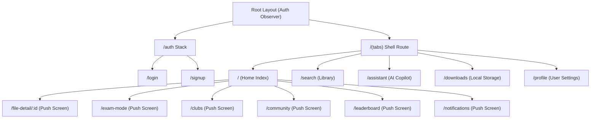

# 📱 Sutras Mobile App Specification & Flutter Migration Blueprint
> **"The Student OS"** — Technical Specification, Product Requirement Document (PRD), Design System, and React Native to Flutter Migration Guide.

---

## 📖 Table of Contents
1. [Product Requirement Document (PRD)](#1-product-requirement-document-prd)
2. [Technical Requirement Document (TRD)](#2-technical-requirement-document-trd)
3. [UI/UX Design System Specification](#3-uiux-design-system-specification)
4. [App Flow & Navigation Mapping](#4-app-flow-navigation-mapping)
5. [Backend Database Schema (Firestore)](#5-backend-database-schema-firestore)
6. [Web-to-Mobile Interlinking & Shared APIs](#6-web-to-mobile-interlinking--shared-apis)
7. [React Native to Flutter Migration Blueprint](#7-react-native-to-flutter-migration-blueprint)

---

## 1. Product Requirement Document (PRD)

### 🎯 Product Vision
Sutras Mobile is designed to be the ultimate companion app for college students. It provides an AI-native, gamified workspace that integrates campus community feeds, student clubs, previous year question paper archives, academic notes, assignment tracking, and an interactive AI study partner (Sutras Copilot).

### 👥 Target Audience
* **College Students**: Preparing for exams, collaborating on study materials, and participating in college clubs.
* **Faculty/Admins**: Reviewing student contributions, uploading notes, and broadcasting updates.

### 🌟 Key Product Features & Functional Requirements

#### 1. Home Dashboard
* **Daily Streak Tracker**: Visual calendar displaying user daily check-in streaks (powered by a gamified rewards logic).
* **Bento Stats Grid**: High-level counters for user contribution points, uploaded materials, and assignment checklist deadlines.
* **Category Quick Access**: Clean icon-grid links to core platform tools (Library, Exam Mode, Clubs, Community, Leaderboard).
* **Live Campus Feed**: Compact scrollable card grid of the latest approved notes and announcements.

#### 2. Library & Search
* **Search-First Design**: Dedicated magnifying search console with instantaneous character-by-character filtering.
* **Format-Specific Filters**: Dynamic tag chips to filter between `Notes`, `PYQ` (Previous Year Questions), and `Assignments`.
* **Resource Cards**: Shows filename, size, subject tag, approval status, and contributor profile attribution.

#### 3. Sutras AI Academic Partner (Sutras Copilot)
* **Real-Time Chat Interface**: Interactive text console with typing indicators mimicking human thinking patterns.
* **Contextual Copilot**: Powered by Gemini to answer academic questions, provide step-by-step mathematical derivations, and summarize syllabus units.
* **Syllabus Grounding**: Restricts tool usage to verified university curriculum resources when matching specific search terms.

#### 4. Exam Mode (Automated Study Room)
* **Milestone Countdown**: Precise visual clock timer counting down to the next university exam.
* **Unit Planners**: Checklist cards mapping out subjects by unit, caching completion progress locally.
* **Flip Definition Cards**: Interactive flashcard widgets with linear gradient styles that flip on tap to reveal textbook derivations.
* **AI Mock Exams**: Pre-computes predicted exam questions and weights them according to past university distribution metrics.

#### 5. Campus Clubs Hub
* **Club Explorer**: Carousel-style cards grouped by categories (e.g., Coding, Robotics, Music).
* **Sub-Modules inside Clubs**:
  * **Announcements**: Bulletins sent by club admins.
  * **Chat Rooms**: Real-time group chatting restricted to approved members.
  * **QA Panels**: Student-led Q&A forums.
  * **Projects & Gallery**: Visual showreel of active projects and pictures.
  * **Application Form**: Native application sheet to request to join a club.

#### 6. Gamified Leaderboard
* **Podium Rank Display**: Three-dimensional podium deck showcasing 1st, 2nd, and 3rd rank student contributors.
* **Global Table**: Ordered roster ranking students by contribution points.
* **Self-Highlight**: Explicitly anchors the current user's profile card at the bottom of the viewport if they are outside the top ranks.

---

## 2. Technical Requirement Document (TRD)

### 🛠️ Existing React Native Stack vs. Target Flutter Stack

| Technology Layer | React Native (Current) | Flutter (Target Migration) |
|---|---|---|
| **Language** | TypeScript / JavaScript | **Dart (v3.x)** |
| **Framework** | React Native (v0.81.5) | **Flutter SDK (v3.22+)** |
| **Tooling & Build** | Expo SDK 54 / EAS | **Flutter CLI / Gradle / Xcode** |
| **Navigation** | Expo Router (File-based) | **GoRouter** (Declarative routing) |
| **Database** | Firebase JS SDK (v12.x) | **Firebase Flutter SDK** (`cloud_firestore`) |
| **Authentication** | Firebase Auth + AsyncStorage | **Firebase Auth** (`firebase_auth`) + `shared_preferences` |
| **Storage** | Firebase Storage | **Firebase Storage** (`firebase_storage`) |
| **AI Integration** | `@google/generative-ai` SDK | **`google_generative_ai`** Dart package |
| **Local Cache** | AsyncStorage | **`shared_preferences`** / **`hive`** or **`isar`** |
| **Animations** | `react-native-reanimated` | **Flutter Animation Controller / Rive** |

### 📦 Recommended Flutter Packages
Add these dependencies to your `pubspec.yaml` when migrating:
```yaml
dependencies:
  flutter:
    sdk: flutter
  
  # Firebase Services
  firebase_core: ^3.0.0
  firebase_auth: ^5.0.0
  cloud_firestore: ^5.0.0
  firebase_storage: ^12.0.0
  firebase_messaging: ^15.0.0 # Push notifications
  
  # State Management & Routing
  flutter_riverpod: ^2.5.1    # Riverpod for state management (highly recommended for hook-like flows)
  go_router: ^14.0.0          # File-path-like routing engine
  
  # UI & Media
  google_fonts: ^6.2.1        # Custom typography fonts
  flutter_markdown: ^0.7.2    # Text rendering for Copilot calculations and mathematical symbols
  cached_network_image: ^3.3.1 # Caching student avatars and club banners
  flutter_svg: ^2.0.10.1      # SVG asset rendering
  
  # Device Utilities
  shared_preferences: ^2.2.3  # Local cache storage (streaks, checkmarks, theme)
  file_picker: ^8.0.0         # Selecting attachments and PDF study material uploads
  open_file: ^3.3.2           # Opening local downloaded PDFs
  share_plus: ^9.0.0          # Sharing academic notes with classmates
  path_provider: ^2.1.3       # Accessing local system directories for downloads
```

---

## 3. UI/UX Design System Specification

The design system incorporates modern dark aesthetics (inspired by Unstop and Blinkit), featuring glassmorphic overlays and high-contrast color highlights.

### 🎨 Color Palette Tokens

#### 1. Brand Accents
* **Primary**: `#6366f1` (Indigo Primary - buttons, active markers, progress sliders)
* **Primary Light**: `#818cf8` (Gradient transitions, highlight states)
* **Primary Dark**: `#4f46e5` (Pressed buttons, gradient starts)

#### 2. Status & Gamification Colors
* **Streak Gold**: `#fbbf24` (Badges, streaks, 1st place podium)
* **Success Green**: `#10b981` (Live check-ins, accepted applications)
* **Deadline Orange**: `#f97316` (Exam clocks, approaching deadlines)
* **Alert Red**: `#ef4444` (Validation errors, reporting)
* **Premium Purple**: `#a855f7` (Elite badges, admin indicators)

#### 3. Surfaces
| Component Surface | Dark Theme (Default) | Light Theme |
|---|---|---|
| **bgMain** (Screen Background) | `#0a0a0f` | `#f5f5f7` |
| **bgCard** (Default card background) | `#13131a` | `#ffffff` |
| **bgCardElevated** (Elevated inputs) | `#1a1a24` | `#f8f8fc` |
| **bgInput** (Console fields) | `#1e1e2a` | `#f0f0f5` |
| **Border / Divider** | `#27273a` | `#e5e5e0` |

### 📐 Radius & Spacing Scale
* **Gaps**: `xs: 4px` | `sm: 8px` | `md: 16px` | `lg: 24px` | `xl: 32px`
* **Border Radius**:
  * `sm: 8px` (Filter tags, tag overlays)
  * `md: 14px` (Dominant card border-radius, text fields)
  * `lg: 20px` (Large bento cards, bottom sheets, overlay dialogs)
  * `full: 9999px` (Avatars, search pill bars, toggle switches)

### ✍️ Typography Scale
* **Display (Hero text)**: Size `28pt` | Weight `900`
* **Title (H1)**: Size `22pt` | Weight `800`
* **Header (H2)**: Size `18pt` | Weight `800`
* **Sub-Header (H3)**: Size `15pt` | Weight `700`
* **Body (Regular text)**: Size `14pt` | Weight `500`
* **Caption (Metadata, dates)**: Size `12pt` | Weight `600`
* **Micro (Labels, badges)**: Size `10pt` | Weight `700`

---

## 4. App Flow & Navigation Mapping

Sutras utilizes a file-based routing architecture (`Expo Router`). During Flutter migration, this maps directly to `GoRouter` declarative path declarations:



### 🛣️ Route Paths Mapping Table

| Expo Router Filepath | GoRouter Path String | Route Access | View / Screen Description |
|---|---|---|---|
| `src/app/_layout.tsx` | `/` | Public | Auth listener, redirects based on login state |
| `src/app/(auth)/login.tsx` | `/auth/login` | Public | Credentials sign-in page |
| `src/app/(auth)/signup.tsx` | `/auth/signup` | Public | Student/Teacher registration & profile setup |
| `src/app/(tabs)/index.tsx` | `/home` | Protected | Dashboard main console, Bento grids |
| `src/app/(tabs)/search.tsx` | `/search` | Protected | Library resource browser, category filter chips |
| `src/app/(tabs)/assistant.tsx` | `/assistant` | Protected | AI Copilot Chat console |
| `src/app/(tabs)/downloads.tsx` | `/downloads` | Protected | Offline download progress tracker & viewer |
| `src/app/(tabs)/profile.tsx` | `/profile` | Protected | Student stats card, edit preferences, theme toggle |
| `src/app/file-detail/[id].tsx`| `/file/:id` | Protected | File download console, rating stars, uploader info |
| `src/app/exam-mode.tsx` | `/exam-prep` | Protected | Exam countdown timer, units planner, flipcards |
| `src/app/clubs.tsx` | `/clubs` | Protected | Campus clubs portal & application |
| `src/app/community.tsx` | `/community` | Protected | Forum discussion stream, post editor |
| `src/app/leaderboard.tsx` | `/leaderboard` | Protected | contribution points leaderboard rankings |
| `src/app/notifications.tsx` | `/notifications` | Protected | Live updates, admin announcements |

---

## 5. Backend Database Schema (Firestore)

Sutras uses Cloud Firestore as its primary data layer. Below are the structures of the key collections:

### 1. `users`
* **Path**: `/users/{uid}`
* **Document Schema**:
  ```json
  {
    "uid": "String",
    "name": "String",
    "email": "String (Verified)",
    "role": "String ('student' | 'teacher')",
    "isAdmin": "Boolean",
    "collegeId": "String",
    "branch": "String (e.g. 'Computer')",
    "year": "String (e.g. '1st Year')",
    "classId": "String (e.g. 'CO-FE-A')",
    "points": "Number",
    "streakCount": "Number",
    "lastCheckIn": "Timestamp",
    "fcmToken": "String (FCM Push Address)"
  }
  ```

### 2. `files`
* **Path**: `/files/{fileId}`
* **Document Schema**:
  ```json
  {
    "fileId": "String",
    "title": "String",
    "subject": "String",
    "type": "String ('Notes' | 'PYQ' | 'Assignment')",
    "fileUrl": "String (HTTPS file downloader endpoint)",
    "uploaderUID": "String",
    "uploaderName": "String",
    "collegeId": "String",
    "status": "String ('pending' | 'approved')",
    "downloads": "Number",
    "reportsCount": "Number",
    "points": "Number (awarded to uploader)",
    "createdAt": "Timestamp"
  }
  ```

### 3. `posts` (Forum / Community)
* **Path**: `/posts/{postId}`
* **Document Schema**:
  ```json
  {
    "postId": "String",
    "authorId": "String",
    "authorName": "String",
    "authorEmail": "String",
    "content": "String",
    "tag": "String (e.g. 'Exam', 'Coding', 'General')",
    "likes": "Array [uids]",
    "commentsCount": "Number",
    "createdAt": "Timestamp"
  }
  ```

### 4. `submissions` (Assignments & Homework)
* **Path**: `/submissions/{submissionId}`
* **Document Schema**:
  ```json
  {
    "submissionId": "String",
    "assignmentId": "String",
    "studentUID": "String",
    "studentEmail": "String",
    "fileUrl": "String (Uploaded answer PDF)",
    "marks": "Number",
    "feedback": "String",
    "gradedAt": "Timestamp",
    "createdAt": "Timestamp"
  }
  ```

---

## 6. Web-to-Mobile Interlinking & Shared APIs

The web application (Next.js) and the mobile application (React Native / Flutter) share the same backend, syncing files and features in real-time.

```
                  ┌───────────────────────┐
                  │   Next.js (Web App)   │
                  └───────────┬───────────┘
                              │ Writes to Firestore / Hosts APIs
                              ▼
  ┌──────────────┐    ┌──────────────┐    ┌───────────────────┐
  │ Firebase     │◄───┤  Cloud       │◄───┤ Flutter Client    │
  │ Auth         │    │  Firestore   │    │ (Mobile App)      │
  └──────────────┘    └──────────────┘    └─────────┬─────────┘
                                                    │ Downloads Files / Requests AI
                                                    ▼
                                          ┌───────────────────┐
                                          │ Next.js Backend   │
                                          │ API endpoints     │
                                          └───────────────────┘
```

### 🔗 Core Interlinking Integration Points

#### 1. Dynamic Downloader API (`/api/downloads/[...filepath]`)
* **Purpose**: Rather than exposing raw public file paths, all files are downloaded through this Next.js backend proxy.
* **Authentication**: The mobile app must request this endpoint passing the Firebase ID token in the authorization header:
  `Authorization: Bearer <ID_TOKEN>`.
* **Security & Fallback**: The Next.js API resolves files securely under `/home/username/user-uploads` and blocks folder traversal. In local development, the downloader automatically proxies requests to the live production server (`https://sutraverse.co.in`) if files are missing locally.

#### 2. AI Study Guide Generator (`/api/generate-study-guide`)
* **Purpose**: The mobile app's Exam Mode calls this backend API.
* **Action**: It takes the student's branch, subject, and syllabus, uses Gemini to generate predicted exam questions, flashcards, and unit checklists, and returns structured JSON to render in the mobile UI.

#### 3. Firebase Cloud Messaging (FCM) push dispatcher
* **Purpose**: Broadcaster system.
* **Integration**: When an administrator creates a new notice on the web application, a server-side route triggers a notification payload to target all FCM tokens registered inside the student profiles on Firestore.

#### 4. Shared Real-time Collections
* **Authentication**: The student logs in once. Their account details are immediately visible to both the Web panel (for teachers to grade papers) and the Mobile app (for students to view grades).
* **Community Forum & Chats**: All posts, comments, and club chats posted from the web are immediately visible on the mobile app, and vice versa.

---

## 7. React Native to Flutter Migration Blueprint

### 🧭 Step-by-Step Migration Plan

```
┌──────────────────┐      ┌──────────────────┐      ┌──────────────────┐
│ 1. Setup Project │ ───> │ 2. Migrate Auth  │ ───> │ 3. Setup Routes  │
└──────────────────┘      └──────────────────┘      └──────────────────┘
                                                              │
┌──────────────────┐      ┌──────────────────┐      ┌─────────▼────────┐
│ 6. Test & Deploy │ ◄─── │ 5. Add AI Native │ ◄─── │ 4. Build screens │
└──────────────────┘      └──────────────────┘      └──────────────────┘
```

#### Step 1: Initial Flutter Project Setup
1. Create a clean Flutter project supporting Android and iOS:
   ```bash
   flutter create --org co.in.sutraverse --platforms android,ios sutras_mobile
   ```
2. Set up the `pubspec.yaml` with the dependencies listed in the [TRD section](#package-packages).
3. Connect the Flutter app to your Firebase console. Download `google-services.json` (Android) and `GoogleService-Info.plist` (iOS) and place them in respective folders.

#### Step 2: Authentication & Cache Migration
1. Re-implement the authentication logic using the `firebase_auth` package.
2. Initialize `shared_preferences` to store the active user's local settings (e.g. checkmarked syllabus units, daily streak check-in date, and color theme setting).

#### Step 3: Navigation Config (GoRouter Setup)
Translate the file-based routes of React Native to Dart.
* Create a dedicated `routing.dart` containing GoRouter declarations matching the paths in the [Navigation Mapping table](#navigation-mapping).
* Use GoRouter's `redirect` parameter to redirect unauthenticated users to `/auth/login`.

#### Step 4: UI Design Translation (Widgets Implementation)
* Set up colors in `theme.dart` mapping exactly to the Design System colors.
* Create reusable widgets:
  * **BentoCard**: Rounded `Container` with gradient parameters and dynamic spacing.
  * **MagnifierSearchConsole**: Glow-focused custom TextField.
  * **ResourceListItem**: File listing widget displaying uploader information.
  * **InteractiveFlipCard**: Double-sided Widget powered by custom animation controllers (tapped to flip definition flashcards).

#### Step 5: Integrating AI Features (Sutras Copilot in Dart)
1. Initialize the generative AI controller:
   ```dart
   import 'package:google_generative_ai/google_generative_ai.dart';
   
   final model = GenerativeModel(
     model: 'gemini-2.5-flash',
     apiKey: const String.fromEnvironment('GEMINI_API_KEY'),
     systemInstruction: Content.system('You are Sutras Copilot...'),
   );
   ```
2. Build a Chat View using `ListView.builder` paired with a custom animating typing indicator state.
3. Integrate `flutter_markdown` to parse formatted mathematical equations and textbook derivations properly in standard plain-text format.

#### Step 6: Testing & Compiling Builds
1. Verify Firebase connection: Run reads/writes on Firestore collections from the emulator.
2. Test secure file downloading using Http Clients (e.g., `dio` or native `http` requests) passing headers.
3. Build release packages:
   ```bash
   flutter build apk --release
   flutter build ipa --release
   ```
